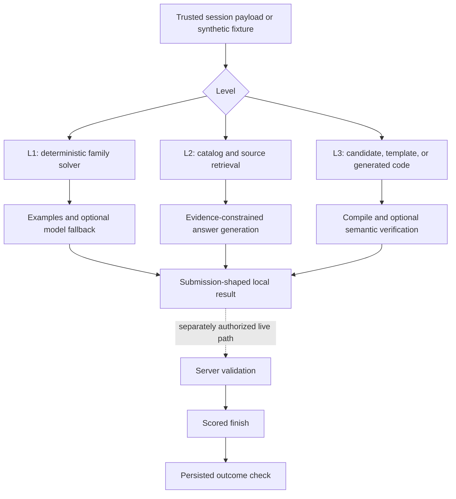

# Architecture: specialize first, verify in layers

[← Documentation](README.md) · [Challenge format](challenge.md) · [Testing](testing.md)

Each level has a different bottleneck, so each gets a different solver. TypeScript coordinates retrieval, code generation, verification, and optional live clients. C, C++, and Rust provide the native implementations and harnesses. Models are replaceable contributors to the pipeline—not its only source of truth.

## Version boundary

V2 and V3 own separate source trees, tests, fixtures, and package scripts. The root supplies a lockfile, aggregate checks, documentation, and CI. Shared-lineage code is duplicated deliberately to preserve the historical adapter and make version-specific behavior reviewable.

V2 is frozen for research comparison except for reproducibility, documentation, or security fixes. V3 is the primary preserved implementation. Neither workspace is a claim of compatibility with a later challenge deployment.

## The system at a glance

The synthetic rehearsal stops before the dotted boundary. It uses one local example per level and compiles a Level 3 candidate. Normal live runners have different verification policies; not every mode runs every box.

## Level 1: deterministic specialization

**Contract:** a problem supplies a signature, statement, and examples; the solver returns JavaScript source plus whether the family was recognized.

[The factory catalog](../solutions/v3/src/level1/solutions.ts) maps recognizable function families to implementations. Both snapshots retain 95 entries. Unknown problems and sample-failing solutions can take a [model-assisted path](../solutions/v3/src/level1/llm.ts). The [runner](../solutions/v3/src/level1-runner.ts) assembles the session's submissions; the [client](../solutions/v3/src/level1/api.ts) owns server interaction separately.

This is not an answer map keyed only to a previous run's problem IDs. The distinction matters because the bank changed between sessions. Public sample execution improves confidence, but hidden correctness and a scored finish remain separate evidence.

Read with: [solver tests](../solutions/v3/tests/level1-solver.test.ts), [V3 catalog tests](../solutions/v3/tests/level1-v3-catalog.test.ts), and [API contract tests](../solutions/v3/tests/level1-api.test.ts).

## Level 2: retrieval before generation

**Contract:** questions are normalized and matched to an answer catalog; unresolved items carry evidence into optional source lookup/model fallback.

The [catalog adapter](../solutions/v3/src/level2/catalog.ts) extracts entries from captured application chunks and matches question text. [Source tools](../solutions/v3/src/level2/tools.ts) use bounded GitHub CLI search against known repositories. [The model layer](../solutions/v3/src/level2/llm.ts) is downstream of that evidence rather than a replacement for retrieval.

The full captured catalog is not distributed. The public rehearsal includes one deliberately synthetic catalog item so a clone can exercise the adapter without private captures. Catalog extraction remains an upstream-format assumption that can drift.

Read with: [catalog tests](../solutions/v3/tests/level2-catalog.test.ts), [tool tests](../solutions/v3/tests/level2-tools.test.ts), and [LLM tests](../solutions/v3/tests/level2-llm.test.ts).

## Level 3: preserve the ABI, then improve behavior

**Contract:** one task family and language define a public native interface. The pipeline must return compilable source that implements that interface and survives semantic and scale checks.

The selection layers are:

1. [Registered candidate](../solutions/v3/src/level3/candidates.ts): reviewed source for a family/language pair, with historical provenance.
2. [Family template](../solutions/v3/src/level3/templates/index.ts) or [specialist](../solutions/v3/src/level3/specialists/trait-expression.ts): reusable deterministic construction where supported.
3. [Model-assisted solve](../solutions/v3/src/level3/llm.ts): generation or targeted repair when there is a gap.
4. [Function-cluster decomposition](../solutions/v3/src/level3/decomposition.ts) or [locked skeleton holes](../solutions/v3/src/level3/skeleton-decomposition.ts): bounded subproblems with shared interfaces. Locked skeleton-hole generation currently targets Trait Expression AST in C, not every family.

[Compilation](../solutions/v3/src/level3/local-compile.ts) builds a shared library and checks its size; it does not compare exported symbols or signatures against the task's ABI. [Local verification](../solutions/v3/src/level3/local-verify.ts) can execute built-in or [generated harnesses](../solutions/v3/src/level3/dynamic-verifier.ts), which provide their own interface and behavior checks. [Repair policy](../solutions/v3/src/level3/run-policy.ts) separates compile repair, semantic feedback, validation plateaus, and time-budget decisions.

Important limits:

- The normal runner's local semantic path is **opt-in**; compilation alone is not a semantic pass.
- Built-in component preflight runs semantic checks for CPU Emulator and Identity Bundle. Other selected families are compile-only in that command.
- A generated verifier is itself generated code and can fail or be unavailable. Inspect `semantic`, `skipSemantic`, and detailed results rather than treating a top-level `ok` as universal coverage.
- Speed mode deliberately skips parts of the ordinary repair/validation loop and defaults to historically verified registry entries. Historical verification is not fresh contract validation.
- Native candidates and harnesses execute on the host. The project is not an execution sandbox.

Read with: [candidate matrix](candidates.md), [run-policy tests](../solutions/v3/tests/level3-run-policy.test.ts), [local verification tests](../solutions/v3/tests/level3-local-verify.test.ts), and [component preflight tests](../solutions/v3/tests/level3-component-preflight.test.ts).

## Browser, identity, and model boundaries

| Boundary | Owner | What it does not establish |
|---|---|---|
| Browser capture and manual OAuth | [recon](../solutions/v3/src/recon.ts), [capture](../solutions/v3/src/recon/capture.ts) | A saved login is not proof that a direct API finish will be accepted. |
| Explicit account identity | [identity](../solutions/v3/src/identity.ts) | A handle alone does not authenticate the user. |
| V3 fingerprint hints | [Level 1 client](../solutions/v3/src/level1/api.ts) | Supplying a payload does not certify that the server trusts it. |
| Model request/response | [provider client](../solutions/v3/src/llm/client.ts) | A schema-valid response is not correct code. Prompts may leave the machine. |
| Stored run output | [capture](../solutions/v3/src/recon/capture.ts), runner modules | Ignored output is not automatically redacted or safe to publish. |

The public snapshot does not import cookies from an everyday browser profile. Historical Safari-native and latency investigations are described in the [V3 story](findings/v3-retrospective.md), not offered as current integrations.

## Why this is a research package, not a universal runner

The repository preserves the parts that are useful to inspect: explicit contracts, specialist solvers, candidates, failure tests, and evidence distinctions. One-off account, flag, timing, and cookie probes were removed from the supported command surface. Their durable lessons belong in [findings](findings/failure-analysis.md), not in a default quick start.

Future changes should tighten one contract at a time and add a reproducible test. Sharing code across versions, adding providers, or introducing a broad abstraction is useful only when it preserves the historical meaning and has a concrete consumer.
